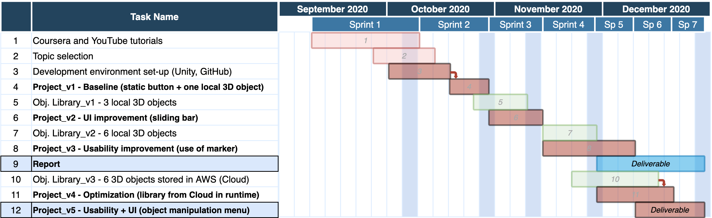

# Augmented Reality Proof Of Concept in Unity

## Introduction
The wide spread of mobile augmented reality applications has shown the feasibility of real-time applications such as room decoration, by projecting 3D furniture models into a real scene.

The Decorator is an augmented reality app built on Android's ARCore in which one can virtually place multiple true-to-scale 3D object models in a real environment using a mobile phone, see Fig 1. In this way, a user is able to, for example, furnish an empty room easily by choosing different objects from a cloud-based catalog that loads into de app. in real time, and instantly have a direct sense of the overall scene. We use several pieces of furniture in this demo project.

The present use case allows to furnish a whole room in just a few taps [1]. The decorator is an exciting way to enjoy design, an easy way to create ideas, and it is easily extensible to other use cases for fast creation of virtual prototypes on top of existing real spaces, by simply uploading new objects to the cloud-based catalog of 3D objects.

Fig. 1. Decorator v2 (left) with sliding bar to show objects. Decorator v5 (right) with added functionality for scaling and rotating virtual objects.

## Project Plan
This project has been developed under a SCRUM methodology, several iterations in the form of Sprints produced the shown tasks distributed along 4 months as in the Gantt diagram of Fig. 2.

Fig. 2. Gantt Diagram.

## Running the project.
The project was developed and built on ***Unity 2019.4.12f1***. To build and run it please import the code as a project into Unity. 

### Dependencies
**Packages:** 
1. Unity's *AR Foundation* 
2. Android's *ARCore* 

**Plug-ins**: 
1. *DOTween* animation engine plug-in

### Virtual cloud
The virtual cloud is used to load the objects from the cloud into the app, it is located in the following Amazon Web Services Bucket
**AWS Bucket: arn:aws:s3:::ardecoratorhelperassets**

Fig. 3. AWS Cloud Database

## Cite this work
    J. Rico, R. Luke, A.C. Fouchier, J. Yang, (2020) Augmented Reality Proof Of Concept in Unity. An Android-based Decorator app. connected to the Cloud.
    [Source code](https://github.com/jvirico/augmented-reality-poc-unity)

## References and Resources
[1] - J. Rico, R. Luke, A.C. Fouchier, J. Yang, (2020) [Augmented Reality Proof Of Concept in Unity. An Android-based Decorator app. connected to the Cloud](./Report.pdf).\
[2] - C. Training,Handheld AR App Development with Unity. [Coursera]("https://www.coursera.org/learn/handheld-ar/home/welcome") [Online; accessed 21-September-2020].\
[3] - J. Lab, Unity AR Foundation tutorial, (2008).  [Tutorial](https://www.youtube.com/c/JoystickLab) [Online; accessed10-November-2020].\
[4] - AR Foundation Placement Indicator by fariazz [Source code here](https://github.com/fariazz/ARFoundationPlacementIndicator).\
[5] - FurnitureAR by Shubhra22 [Source code here](https://github.com/Shubhra22/FurnitureAR/tree/master).